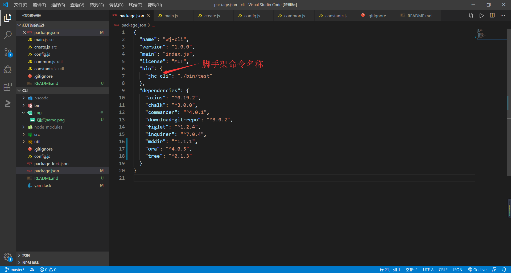
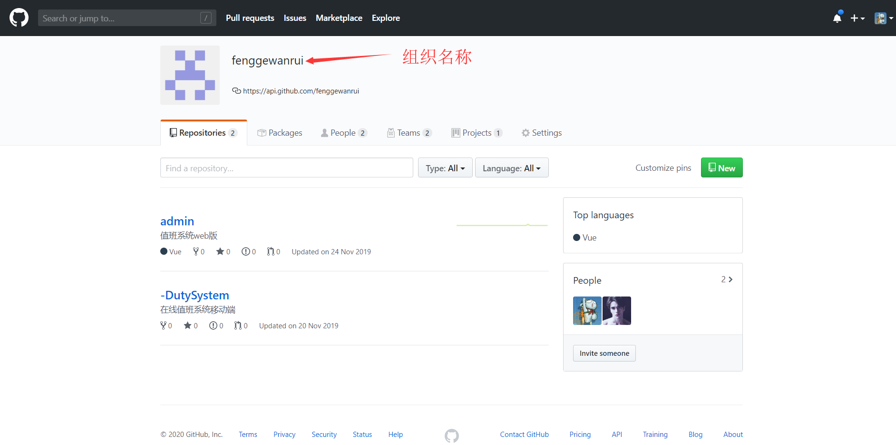
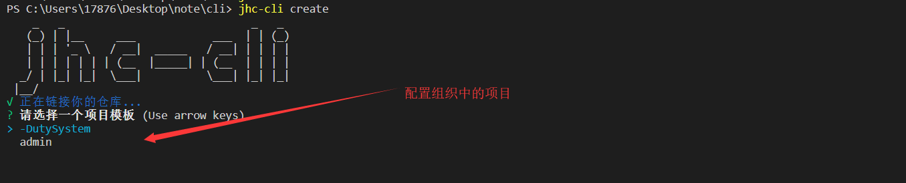
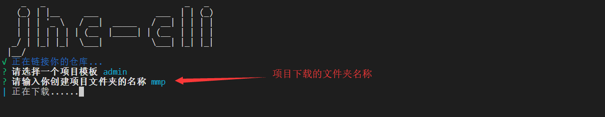
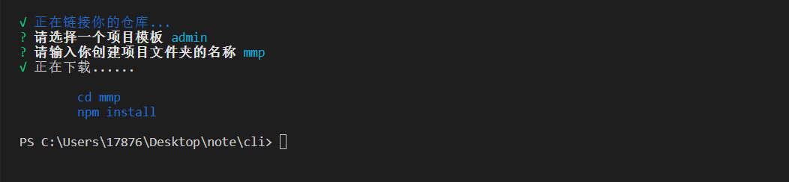

# 基于nodejs的cli工具示例
## 自定义方法
1. clone 
2. npm install下载依赖
   1. > 更改脚手架名称 
3. 在github中创建一个组织
4. 在config中修改Templatehouse为你的组织名
   - 
5. npm link讲命令映射到全局

## 使用命令

- jhc-cli --help 帮助
- jhc-cli create 创建一个项目
  - 
  - 
  - 
- jhc-cli -v     查看版本

